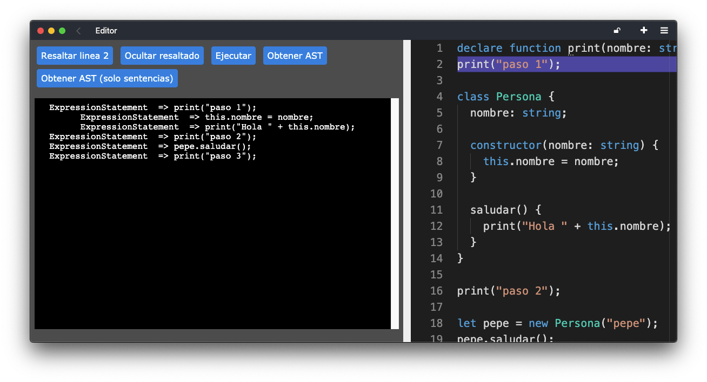

# README

Este proyecto consiste en una prueba sobre typescript y monaco para obtener
el AST del código ingresado y ensayar un seguimiento de la ejecución para
pilas engine 2 (www.pilas-engine.com.ar)



## Como ejecutar en un entorno local

Existen dos formas, si utilizas docker ejecutá:

```
docker-compose up
```

Sino, podes levantar la aplicación usando estos comandos:

```
→ ruby -v
ruby 2.7.1p83

→ rails -v
Rails 6.0.3.2
```

y luego ejecutar:

```
bundle install
rails s
```
